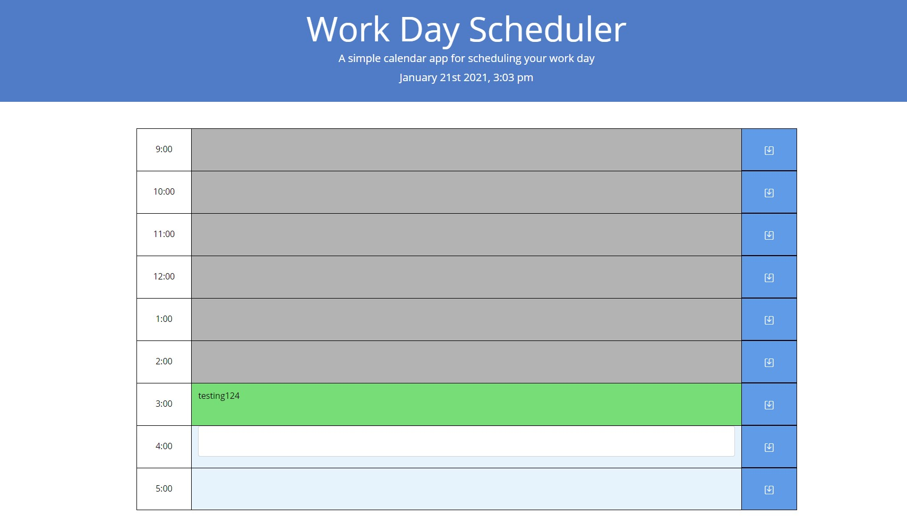
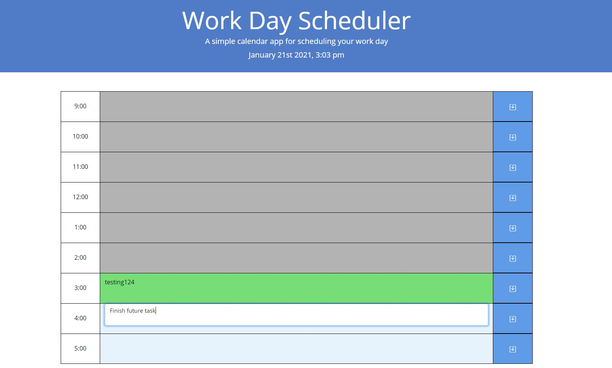

# HW05 - Work Day Scheduler

## Description 

Workday planner is a simple application that allows for the user to enter 

## Installation

Navigate to code repository at https://github.com/mpkahn/homework05 and close if desired. From there use code editor to view html, css, and js files.

## Usage 

In order to use application, navigate to https://mpkahn.github.io/homework05/ and view the hour-blocks available from 9am - 5pm. You can see the current date/time at the top of the page in the header.

Hour-blocks that have already passed will be grey, the current hour-block will be green, and future ones will be a light blue. You can click into either the current or future blocks to enter items you wish to remember for your to-do list. 

## Credits

Moment.js for the script to properly pull current time into the javascript https://momentjs.com/
Many references to both sites like w3schools and mozilla developer docs https://developer.mozilla.org/en-US/docs/Web/API/Element/closest
Icons and other resources from bootstrap https://icons.getbootstrap.com/#install
Colors from google material design guide https://material.io/design/color/the-color-system.html#color-usage-and-palettes

## License

MIT License

Copyright (c) [year] [fullname]

Permission is hereby granted, free of charge, to any person obtaining a copy of this software and associated documentation files (the "Software"), to deal in the Software without restriction, including without limitation the rights to use, copy, modify, merge, publish, distribute, sublicense, and/or sell copies of the Software, and to permit persons to whom the Software is furnished to do so, subject to the following conditions:

The above copyright notice and this permission notice shall be included in all copies or substantial portions of the Software.

THE SOFTWARE IS PROVIDED "AS IS", WITHOUT WARRANTY OF ANY KIND, EXPRESS OR IMPLIED, INCLUDING BUT NOT LIMITED TO THE WARRANTIES OF MERCHANTABILITY, FITNESS FOR A PARTICULAR PURPOSE AND NONINFRINGEMENT. IN NO EVENT SHALL THE AUTHORS OR COPYRIGHT HOLDERS BE LIABLE FOR ANY CLAIM, DAMAGES OR OTHER LIABILITY, WHETHER IN AN ACTION OF CONTRACT, TORT OR OTHERWISE, ARISING FROM, OUT OF OR IN CONNECTION WITH THE SOFTWARE OR THE USE OR OTHER DEALINGS IN THE SOFTWARE.

